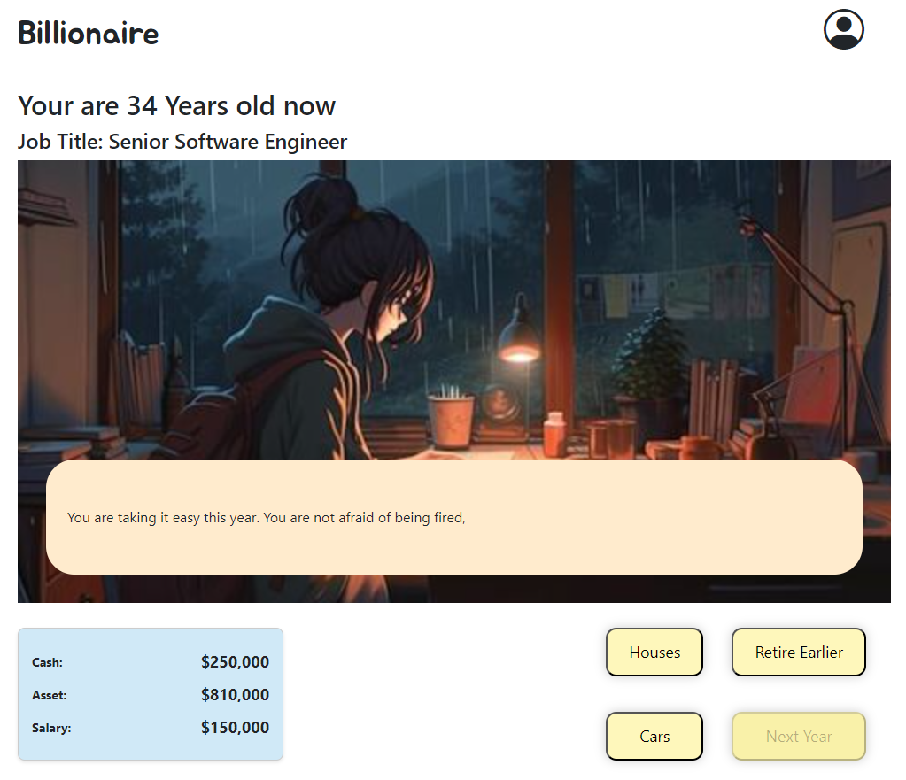
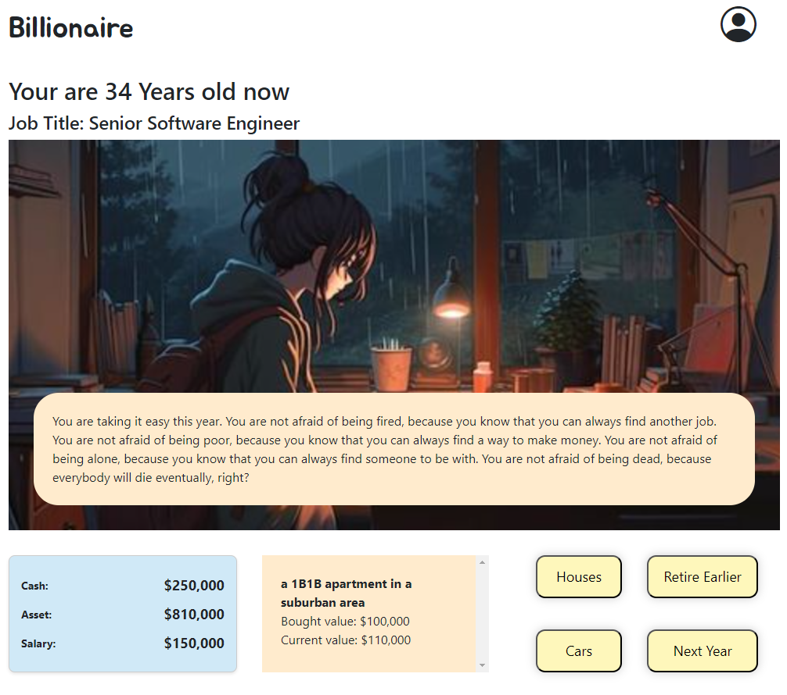
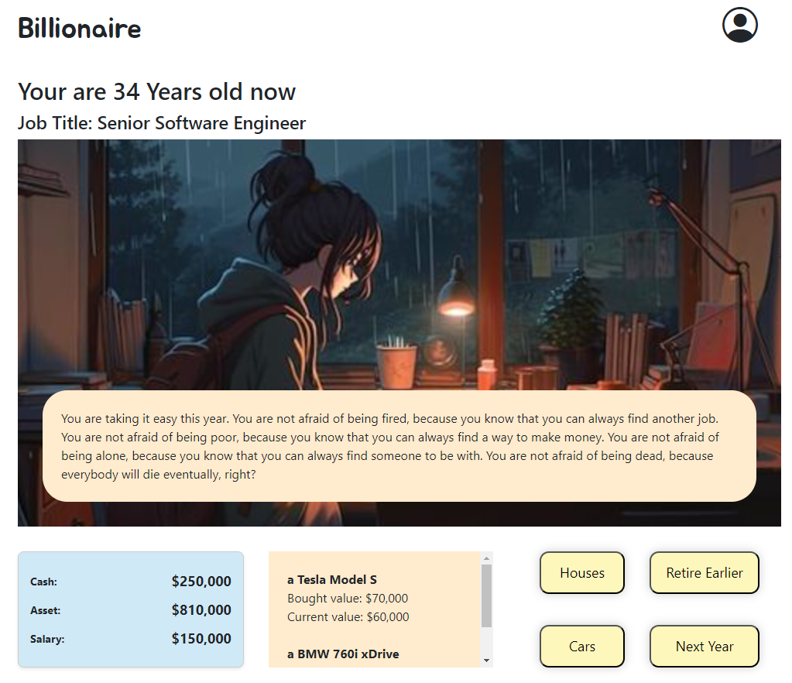
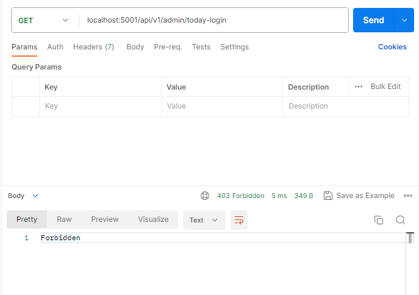
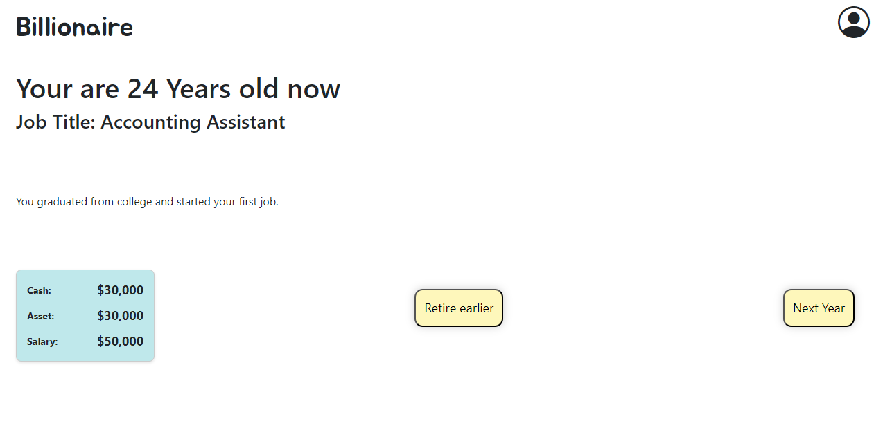
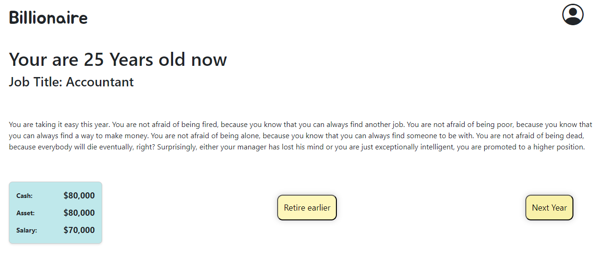
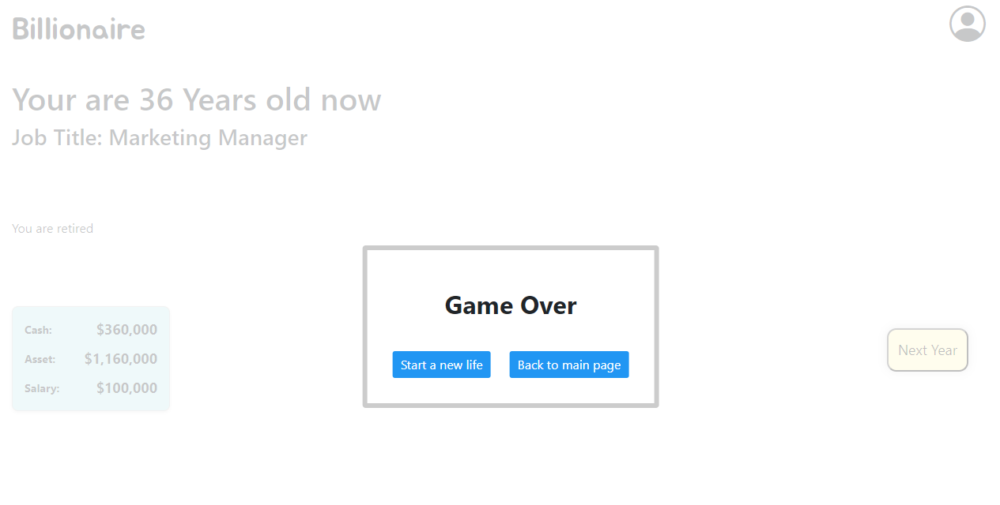

## Intro

[Billionaire](https://billionaire-web.uc.r.appspot.com/) seems like something far away from the lives of ordinary people. However, in this game, you can start and experience a whole new life. Do you aspire to work hard and become a member of the senior management of a company? Or do you want to be a speculator, betting on long shots? Perhaps you envision yourself as a long-term investor, emphasizing steady growth and long-term wealth accumulation? In this game, you have the freedom to be whoever you want and explore a life you've never experienced before. And When your assets reach one billion, you can unlock a hidden surprise!

To login as an admin use
email: su.yue@northeastern.edu
password: bill-admin

## Release

#### V3.0.0
App Progress:

Introduced a new library - recharts. Admin portal daily activity chart implemented.

Make the Game page look better. Add houses/cars property info card. Implemented the animation of typing the message word by word. When typing words, Next year button is disabled. However, you can click the dialouge to speed the typing speed up.




#### V2.0.0
App Progress:

Finished the implementation of Admin Portal - admin now can see daily active user number and daily registered new user number. Admin can also delete users from admin portal. In addition to that, backend apis are now protected by session - users cannot simply sending requests and trigger admin actions.

Request send from Postman is Forbidden


Implementation of Game Page.


Click Next Year to go to the next year


Click retire earlier to Stop the game or play until age reached 35 and retire


#### V1.0.0
App Progress:

Finished the implementation of a simple user auth workflow. User now can register and login. Admin will be logged in to the admin page. Normal users would not have access to the admin portal.

## Tech Stack
- react
- redux
- redux-persist
- react-native-async-storage
- axios
- react-router-dom
- @react-oauth/google
- jwt-decode
- react-modal
- recharts

#### Dev dependencies
- husky
- lint-staged
- eslint
- prettier

## To develop locally

Run `npm install`. If you are using mac and failed to run `npm install`, delete node_modules file and try `sudo npm install`

Then make sure the git is initialized for the local repo and run `npm run husky-prepare`. After it finished, you should also see an auto-generated folder called .husky containing a file called pre-commit. This will automatically lint the code before commit.

Then run `cp .env.example .env` and configure the .env file

Then run `cp app.yaml.example app.yaml` and configure the app.yaml file

At last run `npm start` to start developing

## Tool

To format code automatically when save files in the VS Code. First add <ins>Prettier - Code formatter</ins> from VS Code extensions. Then open <ins>Command Palette</ins>. Type "setting.json" and click "...Open User Settings...". Add following configurations if not already

```json
  "editor.formatOnSave": true,
  "[yaml]": {
    "editor.formatOnSave": false
  },
  "[markdown]": {
    "editor.formatOnSave": false
  },
  "editor.defaultFormatter": "esbenp.prettier-vscode",
```
